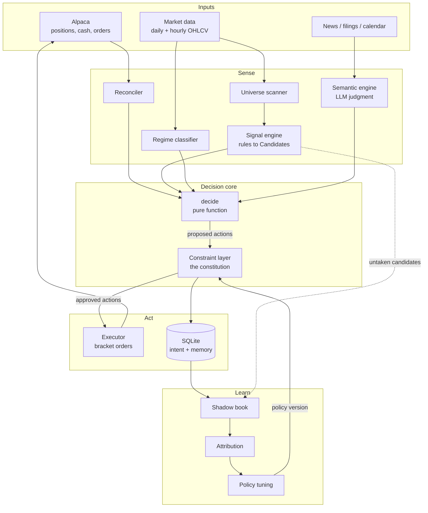

# Trading Bot

An autonomous swing-trading agent for US equities. Given the current portfolio and the available
universe, it decides what the portfolio should look like tomorrow — and executes it.

Broker: **Alpaca** (paper first). Style: **swing**, holds of days to weeks.
Execution: **scheduled, stateless jobs** — no daemon, no `while True`.

> **Current state and next steps: [PLAN.md](PLAN.md).** This file is the
> architecture; that one is the working log and roadmap.

---

## 1. Design goals

1. **Portfolio-centric, not signal-centric.** The unit of decision is *"what is the best use of my
   capital right now?"* — not *"is this one trade good?"* The agent can exit a decent position to
   fund a better one, and can decide to hold cash.
2. **Every decision is replayable.** Same inputs → same actions, forever. Debugging, backtesting,
   and attribution all fall out of this one property.
3. **Autonomy inside a constitution.** The agent makes every call unattended, but a separate,
   immutable constraint layer can veto anything. Strategy changes never touch the rules that keep
   the account solvent.
4. **Learning is designed in, not bolted on.** The decision log, shadow book, and trade forensics
   exist from day one because they cannot be backfilled.
5. **The broker owns money; the database owns intent.** Never mirror what Alpaca already knows.

---

## 2. System overview



---

## 3. The decision core

Everything collapses into one pure function. No broker calls, no DB writes, no clock inside it.

```python
def decide(
    portfolio: Portfolio,          # what we hold, cash, equity, heat, exposure
    candidates: list[Candidate],   # scored setups from the signal engine
    context: MarketContext,        # regime, breadth, volatility, calendar
    policy: Policy,                # versioned constraint + weight config
) -> list[Action]
```

### 3.1 Data models

```python
@dataclass
class Position:
    ticker: str
    qty: int
    entry_price: float
    current_price: float
    stop: float
    target: float
    unrealized_r: float        # (current - entry) / (entry - stop)
    days_held: int
    setup_type: str
    entry_score: float
    thesis: str
    policy_version: str

@dataclass
class Portfolio:
    positions: list[Position]
    cash: float
    equity: float
    open_heat: float           # sum of risk-to-stop across positions, as % of equity
    sector_exposure: dict[str, float]

@dataclass
class Candidate:
    ticker: str
    setup_type: str            # breakout | pullback | mean_reversion
    entry_type: str            # close_confirm | resting_limit
    entry: float
    stop: float
    target: float
    score: float               # 0-100, common scale with held positions
    sector: str
    features: dict             # every input that produced the score
    event_flags: dict          # from the semantic engine

@dataclass
class Action:
    kind: str                  # OPEN | CLOSE | TRIM | ADD | ADJUST_STOP | CANCEL | HOLD
    ticker: str
    qty: int
    limit: float | None
    stop: float | None
    target: float | None
    reason: str                # human-readable, logged
    score: float
    policy_version: str
```

### 3.2 Decision order

Sequence matters — these compete for the same capital.

```
0. RECONCILE      broker truth in, DB annotations joined on
1. DEFENSIVE      exits that are non-negotiable, run first because they free capital
                    - thesis invalidated (semantic engine)
                    - time stop: < 0.5R progress after N days
                    - binary event entering the hold window (earnings, FDA, ruling)
                    - stop/risk breach the broker did not catch
2. CAPACITY       cash, remaining heat budget, sector headroom after step 1
3. RANK           score every candidate AND every held position on one scale
4. ROTATE         swap only if new_score > held_score * switching_premium
5. ALLOCATE       size and fill capacity from the top
6. MAINTAIN       trail stops, trim overweight positions
```

**Holdings are re-scored as fresh entries at today's price and today's stop.** If the agent
wouldn't buy it today, it has no reason to keep holding it. This is what makes step 3 an
apples-to-apples comparison rather than a bias toward whatever is already owned.

### 3.3 Scoring

```
score = w_setup   * setup_quality      # pattern strength: trend, volume, ADX, structure
      + w_regime  * regime_fit         # does this setup type work in the current regime
      + w_rr      * risk_reward        # (target - entry) / (entry - stop)
      - w_event   * event_risk         # penalty for binary events in the hold window
```

Weights live in `config/policy.yaml`, are versioned, and are the thing the adaptive layer tunes.
Score is used for **ranking only** — never to scale position size. Scaling size by a
poorly-calibrated score concentrates capital in the most overfit signals.

### 3.4 Rotation hysteresis

`switching_premium` defaults to **1.3×**, plus estimated costs. Without it a portfolio-level
optimizer churns daily on score noise and pays its entire edge away in spreads. This is the single
most important guard on portfolio-centric logic.

### 3.5 Minimum viable position

Greedy allocation in score order will happily hand a candidate whatever scraps of cash remain — a
4-share position that pays full spread and commission for a tenth of the intended exposure, and
burns a daily slot doing it.

`min_risk_fraction` (default **0.5**) requires a position to reach at least half the per-trade risk
budget. Below that the candidate is not "allocated small" — it is treated as **not fitting**, which
sends it to the rotation path where it can free real capital or be skipped entirely.

---

## 4. The constraint layer (the constitution)

A **separate module** that validates the proposed action list. It does not participate in strategy.
Every rejection is logged with the rule that fired.

| Rule | Default | Rationale |
|---|---|---|
| Max risk per trade | 1.0% of equity | Fixed fractional sizing off stop distance |
| Max portfolio heat | 6.0% total open risk | 8 positions × 2% = 16% simultaneous risk; correlated names fail together |
| Max sector exposure | 25% of equity | Requires a ticker→sector map, cached locally |
| Max single position | 15% of equity | Caps single-name gap risk |
| Min cash reserve | 10% | Size off **cash**, never `buying_power` — margin silently levers you up |
| No earnings in window | hard | A gap makes the stop meaningless, which breaks the entire sizing model |
| Max new positions/day | 3 | Limits correlated same-day entries |
| Daily loss breaker | −3% equity | Halt new entries; keep managing existing |
| Weekly loss breaker | −6% equity | Halt new entries until explicit re-enable |
| Kill switch | `HALT` flag in DB | Manual override — flatten or freeze, checked first |

Position sizing:

```
risk_dollars = equity * max_risk_per_trade
qty          = floor(risk_dollars / (entry - stop))
qty          = min(qty, cash_cap, position_size_cap)   # whole shares only
```

---

## 5. Signal engine — rules first

**Explicit rule-based setups, not a neural network — for now.**

A NN on daily bars has no labeled dataset, a few thousand noisy samples, and no way to separate a
learned edge from memorized history. Worse: it has no record of the agent's own decisions, so it
cannot learn from mistakes it has no memory of making. Rules give an interpretable baseline that a
model must later *beat on the same backtest*. Without that baseline you can never tell whether the
model adds value.

Interface — stable regardless of what's behind it:

```python
def find_setups(bars: pd.DataFrame, context: MarketContext) -> list[Candidate]
```

Initial setups (one module each, under `signals/setups/`):

| Setup | Trigger | Stop | Entry mechanism |
|---|---|---|---|
| `breakout` | Close > 20d high, ADX > 25, vol > 1.5× avg | Below 10d low | Close confirmation |
| `pullback` | Uptrend intact, retrace to 20 EMA, RSI reset | Below swing low | Resting limit |
| `mean_reversion` | 2σ below 20d mean, no downtrend, RSI < 30 | ATR-based | Resting limit |

**The same `find_setups` runs in backtest and live.** Not a reimplementation — the same function.
If the two paths ever diverge, the backtest is fiction.

**Regime classifier** (`signals/regime.py`) emits trend/chop/high-vol from index breadth and
volatility. It feeds `regime_fit` scoring and makes *"no new positions this week"* a legitimate
output. An agent that cannot sit out isn't autonomous, it's compulsive.

---

## 6. Semantic engine (LLM)

**Bounded judgment, negative authority only.** It can veto a setup; it can never create one and
never touches sizing.

No numerical sentiment score. LLM sentiment floats aren't calibrated, drift with prompt phrasing,
and generic sentiment is already priced in. What LLMs are genuinely good at is categorical event
judgment:

```json
{
  "structural_invalidation": false,
  "binary_event_in_window": true,
  "event_type": "earnings",
  "event_date": "2026-11-04",
  "confidence": "high",
  "rationale": "Q3 earnings inside the 10-day hold window"
}
```

Earnings-date avoidance is a **calendar lookup and a hard rule**, applied before any token is spent.
The LLM handles the ambiguous cases the calendar can't: guidance cuts, fraud allegations, CEO
departures, dilution, unexpected M&A.

Second role, monthly: **hypothesis generation** over the trade journal (§9.4).

---

## 7. Execution layer

### 7.1 Entry mechanism depends on setup type

One global entry rule is wrong. Close-confirmation filters intraday fakeouts on breakouts, but
misses most pullback fills where price dips to support at 11:00 and recovers by the close.

| Setup | Mechanism | Job | Order |
|---|---|---|---|
| Breakout / momentum | Close confirmation → submit at 15:30 | `close.py` | Bracket, limit |
| Pullback / mean reversion | Resting limit placed ~10:00, DAY | `open.py` | Bracket, limit, cancelled EOD if unfilled |

Resting limits are *more* aligned with the stateless design, not less — the broker watches the price
instead of cron guessing when to look. Sizing works either way because the trigger price and stop
are both known the night before.

### 7.2 Bracket orders

Entry + stop-loss + take-profit in a single submission. Because there's no daemon, exits **cannot**
be monitored by our code — they're handed to the broker's OCO legs at entry. The trade stays fully
protected even if every cron job fails for a week.

### 7.3 Practical gotchas

- **Idempotency.** Deterministic `client_order_id = f"{ticker}-{date}-{action_kind}"`. Cron retries
  and double-fires happen; the broker rejects the duplicate.
- **ADD to an existing position.** You cannot layer a second bracket over a position that already
  has live exit legs. `ADD` must **cancel the existing OCO, add shares, then re-place exit legs**
  for the combined size. Treat it as a three-step transaction with rollback.
- **Order status is not fill status.** `Submitted` ≠ `Filled`. Status transitions are driven by the
  next reconcile, never by the fact that we sent a request.
- **Market calendar first.** Every job's first line checks the Alpaca calendar and exits on holidays
  and early closes.
- **Data feed delay.** Confirm your feed's latency before trusting the 15:30 check — a delayed feed
  means the close-confirmation job is reading stale prices. Budget for real-time or shift the check.

---

## 8. State model

Two sources of truth, cleanly split. Anything the DB claims that Alpaca doesn't confirm is a bug
you want to see immediately.

| Owner | Owns |
|---|---|
| **Alpaca** | Positions, quantities, fills, cash, equity, order status |
| **SQLite** | Intent and memory — decisions, reasons, theses, scores, candidates, history |

`positions` in the DB is an **annotations table** keyed by ticker (thesis, setup type, entry score,
policy version), joined against live broker positions at runtime. It never stores quantity as truth.

### 8.1 Schema

| Table | Purpose |
|---|---|
| `candidates` | Nightly scan output: ticker, setup, entry/stop/target, score, features, status |
| `positions` | Annotations on live holdings: thesis, setup type, entry score, policy version |
| `decisions` | Every action emitted — including rejections, with the rule that fired |
| `orders` | Submitted orders: `client_order_id`, status lifecycle, fills |
| `trades` | Closed trades: realized R, MFE, MAE, post-exit path, exit reason |
| `shadow_book` | Untaken candidates and their hypothetical outcomes |
| `policy_versions` | Versioned config — every trade records which produced it |
| `strategy_changes` | Proposed adaptations with evidence and sample size |
| `runs` | Job execution log: start, end, outcome, errors |

Candidate status lifecycle:

```
Pending → Cancelled (semantic veto | constraint rejection | ranked out)
        → Submitted → Filled
                    → Expired (unfilled at EOD)
                    → Rejected (broker)
```

---

## 9. The learning system

### 9.1 The binding constraint is trade count

Hold ~8 positions at ~10-day averages and you exit ~0.8 positions/day: **200–400 labeled outcomes
per year.** You cannot train a neural network on that. In a domain where good decisions routinely
lose and bad ones routinely win, you'd need orders of magnitude more.

So the design question is *how do I extract the most learning per trade?* Three loops, each matched
to its own data rate:

| Loop | Cadence | Samples/yr | Learns |
|---|---|---|---|
| **Execution** | Daily | Thousands | Slippage, fill rates, limit offsets, which entry mechanism works per setup |
| **Attribution** | Monthly | 50–400 | Which setups/regimes/sectors have positive expectancy |
| **Parameters** | Quarterly | Needs years | Walk-forward refit of weights, stops, hold windows |

The execution loop pays off in weeks and everyone ignores it. The attribution loop is where the
money is: grouped statistics over tagged trades are actionable at 40 samples, and they tell you
*why* — which a model wouldn't.

### 9.2 The shadow book — the biggest lever

Log every candidate **not** taken: semantic vetoes, constraint blocks, ranked-out, unfilled. Track
what each would have done over the next N days.

- **Multiplies the data rate 10–50×** — you learn from every candidate, not just funded ones.
- **Makes filters falsifiable.** You cannot know whether the LLM veto helps unless you track how
  vetoed setups performed. Without this, that component is unmeasurable forever — it just *feels*
  prudent.

The agent's mistakes include the trades it wrongly *skipped*. Those are invisible unless recorded
deliberately.

### 9.3 Trade forensics

Binary win/loss discards most of the information. Every trade records:

- **MAE** — max adverse excursion: how far against you before it worked
- **MFE** — max favorable excursion: how far in your favor before you exited
- **Post-exit path** — what it did for 10 days after you were out

*"70% of stopped-out trades hit −1.0R then recovered past +2R"* means the stops are too tight — and
that's learnable from 30 trades, not 3,000. Same logic reveals targets that exit too early.

### 9.4 LLM as hypothesis generator

Monthly, feed the trade journal — including the rationale strings written at entry — to the LLM and
ask what patterns it sees: *"6 of 8 losers were sub-$500M float names that gapped through the stop."*
Reasoning over a journal works at low sample counts where fitting does not. Every hypothesis is then
**verified statistically** before anything changes.

### 9.5 Guardrails

A self-adjusting agent with no brakes overfits to its last ten trades.

- **Versioned parameters.** Every trade records its `policy_version`. Without this, attribution
  breaks the moment anything changes.
- **Proposals, not silent edits.** Changes land in `strategy_changes` with evidence and sample size.
- **Minimum 30 trades** in a bucket before any change derived from it.
- **One change at a time**, rate-limited to ~monthly. Change two and you can attribute neither.
- **Shadow mode first** — new parameters run in parallel, logging hypothetical results, before they
  get capital.

### 9.6 Where the neural network eventually fits

As a **drop-in replacement for `find_setups` that must beat the rules baseline** on the same
backtest, out of sample — once there are years of the agent's own labeled decisions. The shadow book
is what eventually produces a training set that's about *this agent's behavior* rather than about
2019. It is the last component, not the first.

---

## 10. Backtesting

A simple event loop that replays `decide()` over historical bars — a few hundred lines, not
backtrader or zipline. The point is code sharing: the backtest calls the *same* `find_setups`,
`decide`, and constraint layer that live trading calls.

Requirements:
- Point-in-time data only — no lookahead, no survivorship bias in the universe
- Realistic fills: spread, slippage, and gap-through-stop modeling
- Emits the same `trades` and `shadow_book` records as live, so the same analysis runs on both

---

## 11. Stack

| Choice | Why |
|---|---|
| **Python 3.11+** | Ecosystem |
| **SQLite + SQLAlchemy** | Single-writer, cron-serialized workload. Perfect fit, zero ops. SQLAlchemy keeps a Postgres migration trivial if it's ever needed. |
| **alpaca-py** | Broker + market data |
| **pandas + pandas-ta** | Indicators |
| **pydantic** | Structured LLM output validation |
| **Anthropic API** | Semantic engine |
| **pytest** | Especially the constraint layer and sizing — where bugs cost money |

**Bars: daily + hourly.** Dropping 4H — a 6.5-hour US session doesn't divide into 4H bars cleanly,
and the ragged final bar creates subtle lookahead bugs.

**Hosting: an always-on VPS**, not a laptop that sleeps. Three cron jobs that silently don't fire is
the most likely failure mode of the whole system.

---

## 12. Repo layout

```
trading_bot/
├── core/                  # the brain -- pure, no I/O, no broker, no network
│   ├── models.py          # Portfolio, Position, Candidate, Action, EventFlags
│   ├── policy.py          # versioned, validated, immutable config
│   ├── sizing.py          # fixed fractional sizing, three caps
│   ├── scoring.py         # one 0-100 scale for candidates AND holdings
│   ├── constraints.py     # the constitution
│   └── decide.py          # decide() -- defensive, capacity, rank, rotate, allocate
├── data/
│   ├── models.py          # Bar, BarSeries (plain lists, not DataFrames)
│   ├── cache.py           # SQLite bar cache, incremental refresh
│   ├── alpaca_data.py     # historical bars, latest prices, calendar
│   └── universe.py        # 85-name liquid universe + sector map + liquidity screen
├── signals/
│   ├── indicators.py      # SMA/EMA/RSI/ATR/ADX/stdev, hand-written and tested
│   ├── engine.py          # Indicators.compute() + find_setups() + scan()
│   ├── regime.py          # trend / chop / high-vol classification
│   └── setups/            # breakout.py, pullback.py, mean_reversion.py
├── backtest/
│   ├── engine.py          # replays decide() bar by bar
│   ├── fills.py           # gap-through-stop, stop-beats-target, slippage
│   ├── simulate.py        # forward simulation for the shadow book
│   ├── records.py         # TradeRecord / ShadowRecord -- shared with live
│   └── metrics.py         # expectancy, MFE/MAE diagnostics, shadow verdicts
├── broker/
│   ├── base.py            # Broker protocol, Account, BrokerOrder
│   ├── paper.py           # in-memory broker with real OCO behaviour
│   ├── alpaca.py          # the live adapter
│   ├── orders.py          # deterministic client_order_id, bracket validation
│   └── reconcile.py       # forces the database to agree with the broker
├── db/
│   ├── schema.py          # 10 tables
│   └── repo.py            # repository
├── semantic/
│   └── client.py          # Claude event-risk screen + earnings calendar
├── jobs/
│   ├── base.py            # calendar gate, run logging, execution, idempotency
│   ├── evening.py         # 18:00
│   ├── premarket.py       # 09:00
│   ├── open_job.py        # 10:00
│   └── close_job.py       # 15:30
├── learning/
│   ├── attribution.py     # live report over the same shapes the backtest emits
│   └── tune.py            # evidence-gated proposals, never silent edits
└── cli.py                 # python -m trading_bot <command>
```

## 13. The daily pipeline

One brain, four wake-ups with different authority. Each job: **check calendar → reconcile → decide →
constrain → act → log.**

| Time (ET) | Job | Allowed actions | Purpose |
|---|---|---|---|
| **18:00** | `evening.py` | All | The main think. Reconcile, review every holding, run the scanner and signal engine, score everything on one scale, rotate, write tomorrow's candidates. |
| **09:00** | `premarket.py` | `CLOSE`, `CANCEL`, `ADJUST_STOP` | Defensive only. Overnight news → semantic engine → veto invalidated setups, react to gaps. |
| **10:00** | `open_job.py` | Execute queued `OPEN` (resting) | After the opening range settles. Place sized bracket limits for pullback entries. |
| **15:30** | `close_job.py` | Execute close-confirmed `OPEN`, `CANCEL` | Breakout confirmation, cancel unfilled day orders, final reconcile. |

Note the ordering fix: **reconcile and review holdings before gating on capital.** The original
design exited early when buying power was low — exactly when you most need to examine what you hold.

The emitted action list, with its `reason` and `score` fields, **is** the decision log. The audit
trail and the learning substrate fall out of the design rather than being bolted on.

---

## 14. Build order

Each phase is independently valuable and testable.

| Phase | Deliverable | Proves | Status |
|---|---|---|---|
| **0** | Data layer, indicators, 3 setups, regime, backtest harness | The loop works end to end. No broker, no LLM. | **done** |
| **1** | `models.py`, `policy.py`, `sizing.py`, `scoring.py`, `constraints.py`, `decide.py` + 58 tests | The money math. Pure Python, no I/O. | **done** |
| **2** | DB schema, repo, reconciler, Alpaca + paper brokers | State stays consistent with Alpaca | **done** |
| **3** | The four jobs + CLI | The plumbing. **Still needs a month of live paper running.** | code done |
| **4** | Shadow book + attribution + diagnostics | Measurement — before adding anything else | **done** |
| **5** | Semantic engine (Claude, structured output) | Then measure whether the veto actually helps | code done |
| **6** | Proposal engine with guardrails | Learning loop closes | **done** |
| **7** | ML signal generation | Only if it beats the rules baseline out of sample | not started |
| **8** | UI layer — static dashboard, then a live server with controls | The bot becomes observable without SQL | not started |

Phases 1 and 2 matter more than any model. Edges in daily-bar swing systems are thin; most of the
value here is disciplined, measurable infrastructure. Build so that in six months *"is the LLM gate
earning its keep?"* is answered with data instead of a feeling.

---

## 15. Changes from the original spec

| Original | Now | Why |
|---|---|---|
| Asset Manager as spending gate | Constraint layer validating a full action list | Portfolio-level decisions need portfolio-level vetoes |
| Quant Engine = neural network | Rule engine, NN deferred to phase 7 | No dataset, no baseline, no way to detect overfitting |
| LLM emits a sentiment score | LLM emits categorical event flags | Sentiment floats aren't calibrated; event classification is what LLMs do well |
| 3 jobs, signal-centric | 4 jobs, all invoking one `decide()` | Enables exits, rotation, and holding cash |
| No open-position management | Defensive pass runs first, every evening | Swing holds decay; brackets alone don't manage a thesis |
| `portfolio_state` / `open_positions` as truth | Alpaca is truth, DB holds intent | Mirrored state drifts, and every drift corrupts a risk calculation |
| `Status='Executed'` on submission | `Submitted → Filled/Expired/Rejected` | Submission is not a fill |
| Single global entry rule | Entry mechanism per setup type | Close-confirmation misses pullback fills entirely |
| Size off `buying_power` | Size off cash + equity risk | `buying_power` includes margin — silent leverage |
| Per-trade risk only | Per-trade risk **and** portfolio heat cap | 8 × 2% = 16% simultaneous correlated risk |
| Daily / 4H bars | Daily / hourly | 4H doesn't divide a 6.5h session; ragged bars cause lookahead bugs |
| No learning infrastructure | Shadow book, MFE/MAE, versioned policy | Cannot be backfilled — must exist before the first live trade |

---

## 16. What the data actually said

Run on 162,890 real daily bars, 91 symbols, 2020-08 to 2026-08. These are
in-sample results on a survivorship-biased universe -- read them as directional,
not as forecasts.

### The strategy as built has no edge

| | Strategy | SPY buy-and-hold |
|---|---|---|
| Total return | +3.75% | **+148.29%** |
| CAGR | 0.61% | 16.31% |
| Max drawdown | 28.25% | 24.50% |
| Return / drawdown | 0.38 | **6.05** |

Expectancy **−0.009R over 1,107 trades**, profit factor 0.98. Not
"underperforming" -- a coin flip that pays the spread, taking more drawdown than
simply owning the index. This is what the benchmark column exists to make
impossible to miss.

### The ranking function is doing nothing

`python -m trading_bot diagnose` over 25,018 candidates:

| Input | n | rho | z | Verdict |
|---|---|---|---|---|
| **score (composite)** | 25,018 | 0.001 | 0.1 | **no signal** |
| setup_quality | 25,018 | −0.047 | **−7.4** | **anti-predictive** |
| ↳ `depth_atr` | 23,874 | −0.078 | **−12.1** | **anti-predictive** |
| ↳ `rsi` | 24,135 | +0.105 | **+16.4** | **predictive** |
| reward_risk | 25,018 | +0.083 | +13.1 | predictive |

The composite score is flat across every decile — lowest-scoring candidates
returned 0.231R, highest 0.238R. Ranking, `min_candidate_score`, and the
rotation premium are all currently coin flips.

The cause: `setup_quality` carries `w_setup = 0.60` and is anti-predictive,
because two heuristics invented without evidence both encode *buy the deepest
dip*. The data says shallow pullbacks in strong names work and deep ones are
falling knives. **RSI is the strongest signal in the dataset and the scorer uses
it upside down.**

### Management may be destroying the entries

Candidates left alone returned **+0.25R**; the same candidates actively traded
returned **−0.009R**. The difference is slippage, rotation, and a 10-day time
stop firing 295 times at +0.037R. The forward simulation holds to stop, target
or 40 days.

### Both corrections held across independent periods

`python -m trading_bot walkforward` -- four sequential folds, plus a holdout no
run has touched. Variants stated before the run, from the diagnostic above.

| Variant | Folds won | Mean exp R | vs baseline | Conclusion |
|---|---|---|---|---|
| baseline | — | −0.042 | — | reference |
| `shallow` | 3/4 | +0.057 | +0.099 | held in most folds |
| `long_hold` | 4/4 | +0.015 | +0.057 | held in **every** fold |
| **`both`** | **4/4** | **+0.111** | **+0.153** | held in **every** fold |

`both` turns a −0.042R system into +0.111R, and does it in all four periods.
That is a real correction, not a fitted one.

**But it still loses to SPY in three folds of four:**

| Fold | `both` return | vs SPY | max DD |
|---|---|---|---|
| F1 2020-08→2021-10 | +17.58% | −20.79% | 8.32% |
| F2 2021-10→2023-01 | −4.73% | **+7.44%** | 11.60% |
| F3 2023-01→2024-03 | +11.55% | −21.54% | 9.34% |
| F4 2024-03→2025-06 | +3.98% | −12.76% | 11.03% |

It only beats the index in the bear period. What the corrections produced is a
**lower-drawdown, lower-return long-only profile** -- roughly reduced beta, not
alpha. Drawdowns are consistently 8-12% against the index's 24.5%, so the
risk-adjusted picture is genuinely better; the absolute return is not.

### Two caveats that limit all of the above

1. **The diagnostic saw every fold.** `shallow` was derived from a run over the
   full period, so the folds are not truly out of sample for it. Only the
   HOLDOUT (2025-06-11 → 2026-08-27) is untouched, and it can be spent once.
2. **Survivorship bias** is unchanged and flatters every number here.

---

## 17. What is NOT wired yet

Being explicit, because these are the things that would make the system look finished while
quietly not working.

| Gap | Impact | What it needs |
|---|---|---|
| **Earnings calendar** | The single hardest-blocking rule has no data source. `StaticEarningsCalendar` reads `config/earnings.json`; with no file it logs a warning and the rule **never fires**. | A real provider. Alpaca does not publish one. |
| **Data feed latency** | The 15:30 close-confirmation check reads `latest_prices()`. On a delayed feed it is reading ~15-minute-old prices and the confirmation is meaningless. | Confirm what your account actually returns, then either pay for real-time or move the check. |
| **`ADD` to a position** | `decide()` never emits it. Layering shares onto a live OCO bracket is a three-step transaction (cancel exits → add → re-place for combined size). The constraint layer already validates it. | Executor work, and a rollback path. |
| **Live paper track record** | Zero. Every number in this repo comes from synthetic data or a survivorship-biased backtest. | A month of `--dry-run`, then a month live on paper. |
| **Survivorship bias** | The universe is a present-day list of names that survived. Backtest returns are optimistic. | No cheap fix. Read relative comparisons, not absolute returns. |
| **Circuit breaker recovery** | Deliberately manual — a tripped weekly breaker stays tripped until `halt --off`. | Nothing, unless you want auto-resume. |

---

## 18. Testing

171 tests, no network, no credentials, ~10 seconds. The ones that carry the most weight:

- **`test_setups.py::test_no_lookahead_*`** — detection at bar *i* is identical whether or not bars
  after *i* exist. If this passes, no indicator and no setup can read the future.
- **`test_backtest.py::test_extending_the_end_date_does_not_change_earlier_days`** — the same
  guarantee at engine level: a run ending on day D must reproduce the equity path of a longer run,
  bar for bar.
- **`test_backtest.py::test_equity_reconciles_with_realised_pnl`** — final equity equals starting
  equity plus the sum of every trade's P&L. Catches money being created or destroyed.
- **`test_constraints.py`** — the constitution cannot be bypassed, and cannot block an exit.
- **`test_reconcile.py`** — every database/broker drift case, including the R-multiple arithmetic on
  a trade reconstructed after the fact.
- **`test_jobs.py::test_a_full_day_cycle_*`** — five sessions end to end; afterwards every broker
  position has an annotation and every annotation the broker cannot confirm is a recorded trade.

---

## Status

**Phases 0-6 are built.** ~6,200 lines of implementation, ~2,500 lines of tests, 171 passing.

The system runs end to end today on synthetic data: scan → score → decide → constitution → broker →
database → reconcile → attribute. What it has never done is trade, because nothing has ever had
credentials.

**Next, in order:**

1. Add Alpaca paper keys, `fetch`, and run a **real backtest**. That is the decision point — if the
   rules show no edge over several years, iterate on `signals/setups/` before anything else. This is
   cheap now and expensive later.
2. Wire an earnings calendar. It is a hard-blocking rule that currently cannot fire.
3. Run the four jobs with `--dry-run` for a couple of weeks and read the decision log.
4. Drop `--dry-run`. Leave it alone for a month.
5. `python -m trading_bot report` — and only then start changing things.
